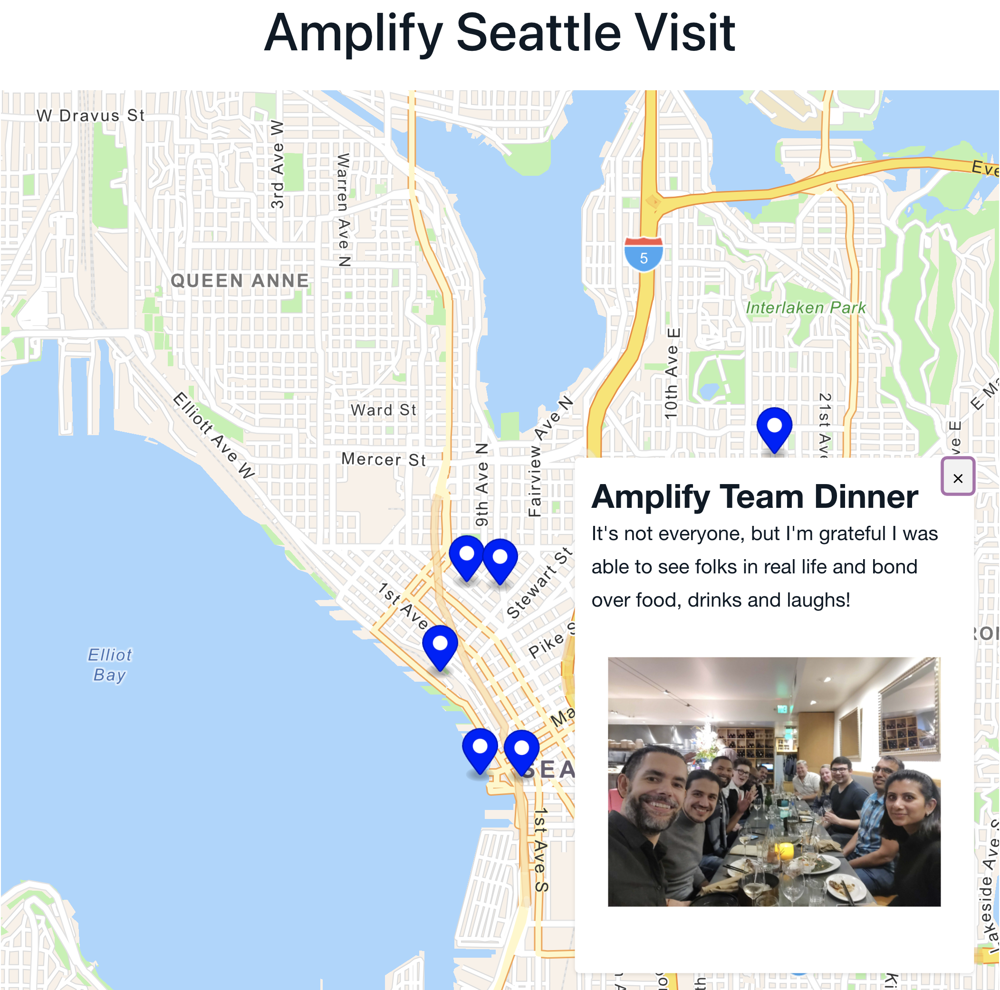
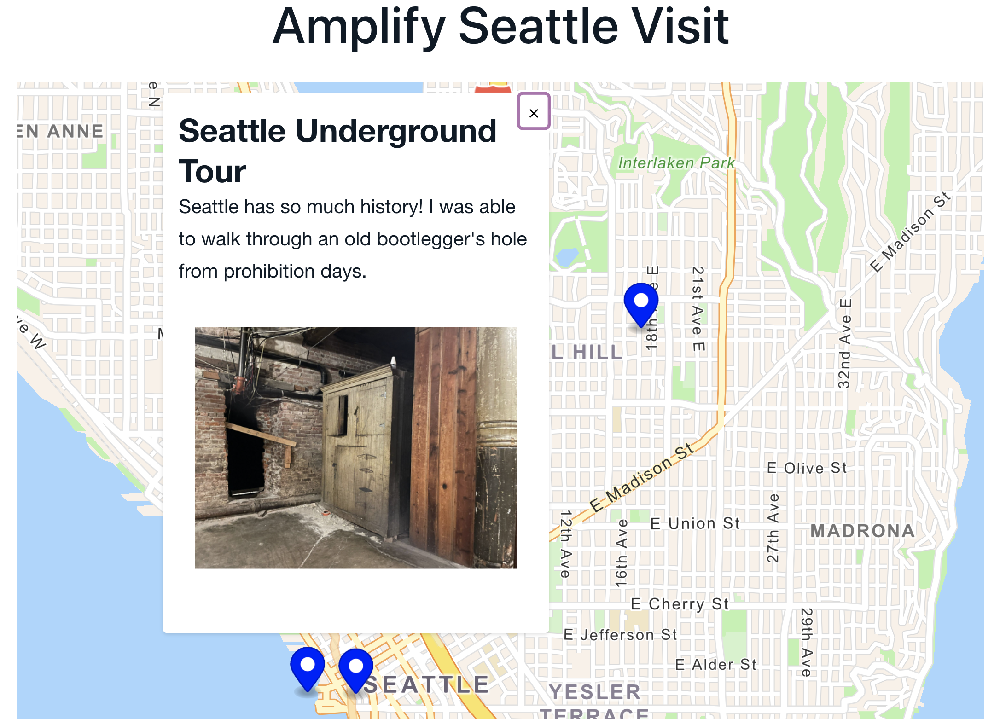

# Seattle: Amplify Team Visit

Recently, AWS Amplify announced an easier way for React developers to add map and search functionality to their applications via the Amplify CLI as well as new AWS-aware Geo components. In this post, we'll take a look at how to easily add that functionality to an application to allow quick delivery of interactive, location-aware products.

The application we'll build is a simple landing page that shows the markers of the amazing time I had with my Amplify friends and coworkers a few weeks ago. It was our first team gathering and as such, I got to explore beautiful Seattle.



> This article assumes you have the Amplify CLI installed. This project makes use of v8.0.0. To install the CLI, run the command `npm install -g @aws-amplify/cli`. For a complete getting started guide, [visit our docs page](https://docs.amplify.aws/start/getting-started/installation/q/integration/react/) for instructions

To get started building out this app, we'll initialize our application by running the following command in our terminal:

```js
npx create-react-app amplify-seattle-map
```

Once the application is created, we'll change into the directory and add a few dependencies.

```js
npm install aws-amplify @aws-amplify/ui-react react-map-gl
```

> The `aws-amplify` dependency contains JavaScript libraries that we can use to interact with AWS from our frontend. The latter dependencies are component libraries that we'll use to add UI to our application. It's worth noting that while the `react-map-gl` library is open-source and contains map components like `<Marker>` and `<Popup>`, the Amplify component library is what has been updated to include the actual `<MapView>` component.

With our dependencies installed, we'll initialize our Amplify project by running the following command in our terminal:

```js
amplify init -y
```

> The `-y` flag tells the Amplify CLI to accept the defaults. Amplify is smart enough to know we are using a React application and identifies our code editor, and chooses our `default` AWS profile.

With our dependencies installed and our project intialized, we can begin adding our map.

To get started, we'll run the following command:

```js
amplify add geo
```

This will walk us through a series of questions. For our purposes, select the following options:

```js
* Capability: Map(visualize the geospatial data)
* Do you want to add auth now: Y
* Authentication Configuration: Default configuration
* User signin: Username
* Enable advanced settings: No, I am done
* Map Name: [provide a map name]
* Map access: Authorized and Guest users
* Advanced Map Settings: Y
* Map Style: Navigation

```

> The map provided by Amplify uses [Amazon Location Service](https://aws.amazon.com/location/) behind the scenes. This mananged service pulls data from both ESRI and HERE providers to ensure accurate location information. In addition, Amazon Location Service manages both data security, as well as privacy.

Now that we've told Amplify how we'd like to configure our map data, let's push up those resources to AWS. Run the following command:

```js
amplify push -y
```

> The `-y` flag simply tells Amplify to automatically confirm our changes.

If it's not already, let's open up our project in our editor and replace the contents of the `src/index.js` file with the following:

```js
import React from 'react'
import { createRoot } from 'react-dom/client'
import { Amplify } from 'aws-amplify'
import { AmplifyProvider } from '@aws-amplify/ui-react'
import App from './App'
import config from './aws-exports'
import './index.css'
import '@aws-amplify/ui-react/styles.css'

Amplify.configure(config)
const container = document.getElementById('root')
const root = createRoot(container)
root.render(
	<AmplifyProvider>
		<App />
	</AmplifyProvider>
)
```

Aside from some default React configuration, we use this setup-file to bring in our component library, a stylesheet, and tie our frontend and backend together with the `Amplify.configure` method.

The main part of our application is actually in the `src/App.js` file.

Let's replace the contents of this file with the following:

```js
import {
	Flex,
	Heading,
	MapView,
	View,
	Text,
	Image,
} from '@aws-amplify/ui-react'
import { useState } from 'react'
import { Marker, Popup } from 'react-map-gl'

function App() {
	return (
		<View>
			<Flex direction={'column'} alignItems={'center'}>
				<Heading level={3}>Amplify Seattle Visit</Heading>
				<MapView
					initialViewState={{
						longitude: -122.3381659,
						latitude: 47.615686,
						zoom: 12,
					}}
					style={{ width: '600px', height: '600px' }}
				>
					{locationData.map((loc) => (
						<MarkerWithPopup
							key={loc.id}
							latitude={loc.latitude}
							longitude={loc.longitude}
							title={loc.title}
							description={loc.description}
							image={loc.image}
						/>
					))}
				</MapView>
			</Flex>
		</View>
	)
}

export default App
```

Amplify's component library comes with a bunch of React primitives that allow us to quickly style and theme our application. We'll only make use of a few of the basic types, but the [Amplify UI docs](https://ui.docs.amplify.aws/components) contains information if wanting to learn more.

In addition to primitives like `Text` and `Image`, we're using the new `MapView` component. This component will automatically pull in the configuration we specified in the CLI and render the tiles on our screen. Note that this is not just a UI component, but one that is fully aware of it being part of AWS (specifically, Amazon Location Service)

From here, we're free to render whatever we'd like on the map. In our case, we're making use of the `Marker` and `Popup` components provided by `react-map-gl`. These two components are flexible enough to be used standalone, but in our case, we'll combine them so that when a marker is clicked, it'll show a popup. This custom component is the `MarkerWithPopup` component.

> This pattern of combining a marker and popup is also documented in the [Amplify UI docs](https://ui.docs.amplify.aws/components/geo#usage-with-react-map-gl).

Let's define that component just above our `App` component. In doing so, add the following:

```js
function MarkerWithPopup({ latitude, longitude, title, description, image }) {
	const [showPopup, setShowPopup] = useState(false)

	const handleMarkerClick = ({ originalEvent }) => {
		originalEvent.stopPropagation()
		setShowPopup(true)
	}

	return (
		<>
			<Marker
				latitude={latitude}
				longitude={longitude}
				onClick={handleMarkerClick}
				scale={0.8}
				color={'blue'}
			/>
			{showPopup && (
				<Popup
					latitude={latitude}
					longitude={longitude}
					offset={{ bottom: [0, -40] }}
					onClose={() => setShowPopup(false)}
				>
					<Heading level={5}>{title}</Heading>
					<Text>{description}</Text>
					<Flex justifyContent={'center'}>
						<Image
							objectFit={'contain'}
							width="200px"
							height="200px"
							src={image}
						/>
					</Flex>
				</Popup>
			)}
		</>
	)
}
```

Here we're making more use of Amplify's React primitives with the addition of the `Image`, `Flex`, and `Heading` components. Furthermore, we're using the `Marker` and `Popup` components from `react-map-gl` by setting an `onClick` handler that'll determine whether or not a `Popup` is shown.

The last callout in the `MarkerWithPopup` component is that we're making use of several props that are passed in from our `App` component.

We're nearly finished. The last step is to create a variable called `locationData` that contains an array of objects.

Feel free to create your own, making sure to supply the needed keys. However to best experience the amazing time that I was able to have in Seattle, I'm linking to [the GitHub repo](https://github.com/mtliendo/seattle-team-visit-map/blob/main/src/App.js#L12-L73) that contains image URL's, titles, and descriptions of some of my favorite events.

If creating your own `locationData` variable, this project expects an array of objects with the following shape:

```js
const locationData = [
	{
		id: 1,
		title: 'Amplify Team Dinner',
		description:
			"It's not everyone, but I'm grateful I was able to see folks in real life and bond over food, drinks and laughs!",
		image:
			'https://aws-map-seattle-blog-pics.s3.amazonaws.com/public/IMG_20220330_204113.jpeg',
		longitude: -122.3098577,
		latitude: 47.6248646,
	}
]
```

To view the application, run the following command

```js
npm run start
```



---

In this tutorial, we explored the newly-announced `MapView` component, and how it can be used with Amplify React primitives, and the `react-map-gl` library. In addition, we explored to how to configure geo applications through the Amplify CLI. As a bonus, if you used my `locationData` from GitHub, you also got to know how my experience was in Seattle!

For more information on Geo connected components, visit [our docs page](https://ui.docs.amplify.aws/components/geo). And for getting started with Amplify and the geo category, visit the Amplify docs for a [full tutorial walkthrough](https://docs.amplify.aws/lib/geo/getting-started/q/platform/js/).
